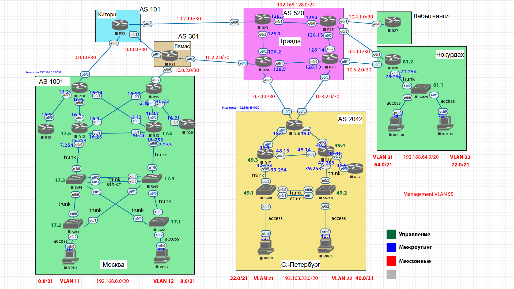

# Архитектура сети

*Рис. 1: План сети*

1. разработаете и задокументируете адресное пространство для лабораторного стенда.
2. настроите ip адреса на каждом активном порту
3. настроите каждый VPC в каждом офисе в своем VLAN.
4. настроите VLAN управления для сетевых устройств
5. настроите сети офисов так, чтобы не возникало broadcast штормов, а использование линков было максимально оптимизировано
6. используете ipv4 и ipv6

# Часть 1. Адресация

## IPv4

Основываясь на схеме задания было решено разделить всю сеть на четыре логические части: три клиентские (Москва, С-Пб, Чокурдах) и одну связующую (Киторн, Ламас, Триада, Лабытнаги).

Основываясь на этой идее, были назначены три больших адресных пространства:

### Москва:

Для клиентских устройств выделен диапазон 192.168.0.0/20, поделенный на две части:

192.168.0.0/21 для VLAN11 (SW3)

192.168.8.0/21 для VLAN12 (SW2)

Для связи между маршрутизаторами:

192.168.16.0/24, нарезанная на подсети с маской /30

На крайних маршрутизаторах резервируются адреса для использовании в качастве шлюза:

192.168.7.254 и 192.168.7.253 для VLAN11

192.168.15.254 и 192.168.15.253 для VLAN12

192.168.7.252 и 192.168.15.252 для обеспечения работы HSRP, соответственно.

### Санкт-Петербург

Для клиентских устройств выделен диапазон 192.168.32.0/20, поделенный на две части:

192.168.32.0/21 для VLAN21 (SW9)

192.168.40.0/21 для VLAN22 (SW10)

Для связи между маршрутизаторами:

192.168.48.0/24, нарезанная на подсети с маской /30

На крайних маршрутизаторах резервируются адреса для использовании в качастве шлюза:

192.168.39.254 и 192.168.39.253 для VLAN21

192.168.47.254 и 192.168.47.253 для VLAN22

192.168.39.252 и 192.168.47.252 для обеспечения работы HSRP, соответственно.

### Чокурдах

Для клиентских устройств выделен диапазон 192.168.0.0/20, поделенный на две части:

192.168.64.0/21 для VLAN31

192.168.72.0/21 для VLAN32

Для связи между маршрутизаторами:

192.168.16.0/24, нарезанная на подсети с маской /30

На маршрутизаторе резервируются адреса для использовании в качастве шлюза:

192.168.71.254 для VLAN31

192.168.79.254 для VLAN32

Адресные пространства в каждом сегменте удобно складываются в целые сети длиной в /19.

### Триада
Для связи маршрутизаторов внутри сегмента Триада 192.168.128.0/24, нарезанная на подсети с маской /30.

Для связи между всеми остальными маршрутизаторами и между сегментами общей сети используется область адресов 10.0.0.0, нарезанная на подсети с маской /30 и распределённые таким образом, чтобы упростить суммаризацию маршрутов для маршрутизаторов на границах областей. Адреса назначаются в соответствии со схемой, слева направо.

## Управление
Для сети управления был выбран VLAN 55.

На каждом участке для L2 устройств, входящих в VLAN управления — ПК, коммутаторов и виртуального транк-интерфейса роутеров — выделена отдельная область адресов.

Москва: 192.168.17.0/24

Санкт-Петербург: 192.168.49.0/24

Чокурдах: 192.168.81.0/24

Таким образом, пограничным маршрутизаторам достаточно анонсировать наружу единственную сеть с префиксом /19.

## IPv6

Логика разбиения сети на логические части и суммаризации адресов остаётся прежней. Адреса назначаются следующим образом:

### Link-local

LLA требуют уникальность только в рамках канала и будут использованы только для работы протокола ospf и тестирования, поэтому распределение адресов не имеет большого значения. Для простоты возьмём стандартный префикс и добавим к нему номер устройства на схеме.
Получим ряд адресов вида `fe80::1 - fe80::31`.

### Unique local

ULA будут использованы для однозначной адресации устройств в сети и каждое устройство будет иметь лишь один такой адрес. Этот адрес будет использован для адресации в сетях с общим доступом и анонсирован в OSPF.

Будут адресованы следующим образом:

### Москва — 1

`fc00::1:1:1/112` - клиенты vlan 11

`fc00::1:2:1/112` - клиенты vlan 12

`fc00::1:3:1/112` - сеть управления

### Спб — 2

`fc00::2:1:1/112` - клиенты vlan 21

`fc00::2:2:1/112` - клиенты vlan 22

`fc00::2:3:1/112` - сеть управления

### Чокурдах — 3

`fc00::3:1:1/112` - клиенты vlan 31

`fc00::3:2:1/112` - клиенты vlan 32

`fc00::3:3:1/112` - сеть управления

### Лабытнаги — 4

`fc00::4:1:1/112`

### Триада — 5

`fc00::5:1:1/112`

### Киторн — 6

`fc00::6:1:1/112`

### Ламас — 7

`fc00::7:1:1/112`

## Loopback
Для возможности адресации маршрутизаторов по IPv6 адресу в глобальной сети создадим на них интерфейсы loopback и добавим их к протоколу OSPF. Получим набор адресов вида:

`fc00::1:ff:1/128`

где третий с краю номеру области сети (по аналогии с адресами выше).

Последний октет везде соответствует номеру устройства на схеме.

## Global Unicast
Не понадобятся в рамках данной работы.

# Часть 2. Прочие настройки

Пары интерфейсов между: SW4 и SW5; SW9 и SW10 настраиваются в режиме etherchannel с использованием протокола LACP (метод согласования active).

Транк- и доступ-интерфейсы коммутаторов назначаются в соответствии со схемой.

Пары маршрутизаторов, используемые в соответствующих областях в качестве маршрута по умолчанию будут объединены в один шлюз при помощи HSRP.

## Примечания и прочее

Неиспользуемые области 4, 5, 6 и 7 останутся просто неиспользуемыми, если в них не подразумевается подключение клиентов.