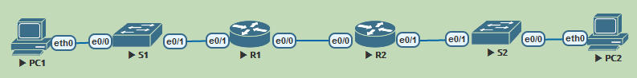

# DHCPv6
**Задачи**
1. Build the Network and Configure Basic Device Settings
2. Verify SLAAC address assignment from R1
3. Configure and verify a Stateless DHCPv6 Server on R1
4. Configure and verify a Stateful DHCPv6 Server on R1
5. Configure and verify a DHCPv6 Relay on R2

**Ход решения**


*Используемая при выполнении работы топология.*

**Адресация в сети**

Устройство | Интерфейс | IPv6-адрес
-|-|-
R1   | G0/0/0 | 2001:db8:acad:2::1 /64
-   | G0/0/0 | fe80::1
-   | G0/0/1 | 2001:db8:acad:1::1/64
-   | G0/0/1 | fe80::1
R2   | G0/0/0 | 2001:db8:acad:2::2/64
-   | G0/0/0 | fe80::2
-   | G0/0/1 | 2001:db8:acad:3::1 /64
-   | G0/0/1 | fe80::1
PC-A | NIC    | DHCP
PC-B | NIC    | DHCP


## Часть 1. Построить сеть и настроить сетевые устройства

### Настроим базовые параметры коммутаторов


Assign a device name to the switch.
```
Switch(config)#hostname S1
```
Disable DNS lookup to prevent the router from attempting to translate incorrectly entered commands as though they were host names.
```
S1(config)#no ip dom look
```
Assign cisco as the VTY password and enable login.
```
S1(config)#line vty 0 4
S1(config-line)#logg syn
S1(config-line)#password thousand
S1(config-line)#login
```
Аналогично для line con 0
Encrypt the plaintext passwords.
```
S1(config)#service password-encryption
```
Create a banner that warns anyone accessing the device that unauthorized access is prohibited.
```
S1(config)#banner motd %
Enter TEXT message.  End with the character '%'.
I'll be the calm
I will be quiet
Stripped to the bone
I wait%
```
Shutdown all unused ports
```
S1(config)#int range e0/2-3
S1(config-if-range)#shut
```
Save the running configuration to the startup configuration file.
```
S1#copy run start
```
Аналогично на втором.

### Настроим базовые параметры маршрутизаторов
Assign a device name to the router.
```
Router(config)#hostname R1
```
Disable DNS lookup to prevent the router from attempting to translate incorrectly entered commands as though they were host names.
```
R1(config)#no ip dom look
```
Assign cisco as the VTY password and enable login.
```
R1(config)#line vty 0 4
R1(config-line)#pass thousand
R1(config-line)#logg syn
R1(config-line)#login
```
Encrypt the plaintext passwords.
```
R1(config)#ser pass
```
Create a banner that warns anyone accessing the device that unauthorized access is prohibited.
```
R1(config)#banner motd %
Enter TEXT message.  End with the character '%'.
I canb^@t control
Withering wonders
Flowers that lose
Their shape%
```
Enable IPv6 Routing
```
R1(config)#ipv6 uni
```
Save the running configuration to the startup configuration file.
```
R1#copy run start
```
Аналогично на втором.

### Настроим интерфейсы и роутинг на обоих роутерах
Укажем адреса в соответствии с таблицей адресации
```
R1(config-if)#int e0/0
R1(config-if)#ipv6 addr 2001:db8:acad:2::1/64
R1(config-if)#ipv6 addr fe80::1 link-local
R1(config-if)#int e0/1
R1(config-if)#ipv6 addr 2001:db8:acad:1::1/64
R1(config-if)#ipv6 addr fe80::1 link-local

R1(config)#ipv6 route ::/0 e0/0 fe80::2
```
И соответственно на R2.
Проверим, как работает.
```
R1#ping 2001:db8:acad:3::1
Type escape sequence to abort.
Sending 5, 100-byte ICMP Echos to 2001:DB8:ACAD:3::1, timeout is 2 seconds:
!!!!!
Success rate is 100 percent (5/5), round-trip min/avg/max = 1/4/19 ms
```
Работает.

## Часть 2. Проверим, как работает SLAAC


