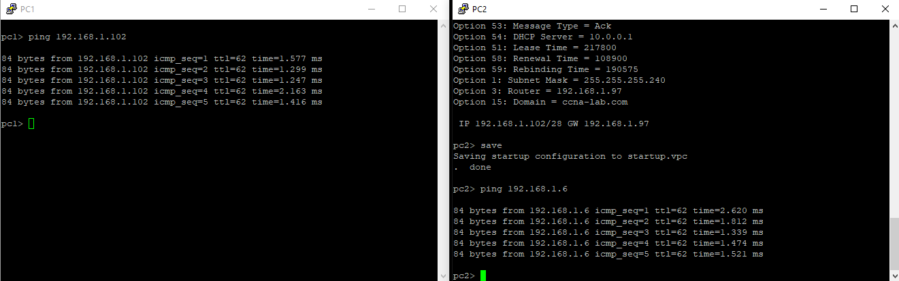

# DHCPv4
**Задачи**
1. Build the Network and Configure Basic Device Settings
2. Configure and verify two DHCPv4 Servers on R1
3. Configure and verify a DHCP Relay on R2


**Ход решения**


*Используемая при выполнении работы топология.*

**Адресация в сети**

Устройство | Интерфейс | IP-адрес | Маска подсети | Шлюз
-|-|-|-|-
R1 | E0/0	    | 10.0.0.1|	255.255.255.252 |	N/A
- | E0/1	    | N/A	    |    N/A |	N/A
- | E0/1.100	|     |	  |	N/A
- | E0/1.200	|     |	  |	N/A
- | E0/1.1000| N/A |	N/A	| N/A
R2 | E0/0	    | 10.0.0.2|	255.255.255.252 |	N/A
- | E0/1	    |     |	  |	N/A
S1 | VLAN 200	|  	  |    |	 
S2 | VLAN 1	    |     |	  |	 
PC-A |	NIC	    | DHCP    |	DHCP |	DHCP
PC-B |	NIC	    | DHCP    |	DHCP |	DHCP

VLAN Table
VLAN |	Name |	Interface Assigned
-|-|-
1 |	N/A	| S2: E0/0
100 |	Clients |	S1: E0/0
200 |	Management| 	S1: VLAN 200 
999 |	Parking_Lot	| S1: F0/1-4, F0/7-24, G0/1-2
1000 |	Native	| N/A


## Часть 1. Построить сеть и настроить сетевые устройства

Разделим сеть 192.168.1.0/24 на три подсети согласно заданию.

**Подсеть А на 58 хостов для клиентов на R1:**

192.168.1.0/26

Первый адрес для E0/1.100 на R1: 192.168.1.1

Второй адрес для VLAN 200 на S1: 192.168.1.2

**Подсеть B на 28 хостов для менеджмента на R1:**

192.168.1.64/27

Первый адрес для E0/1.200 на R1: 192.168.1.65

Второй адрес для VLAN 1 на S2: 192.168.1.66

**Подсеть C на 12 хостов для клиентов на R2:**

192.168.1.96/28

Первый адрес для E0/1 на R2: 192.168.1.97

### Настроим базовые параметры роутеров

Assign a device name to the router.
```
Switch(config)#hostname R1
```
Disable DNS lookup to prevent the router from attempting to translate incorrectly entered commands as though they were host names.
```
R1(config)#no ip domain lookup
```
Encrypt the plaintext passwords.
```
R1(config)#service password-encryption
```
Create a banner that warns anyone accessing the device that unauthorized access is prohibited.
```
R1(config)#banner motd % Go away %
```
Save the running configuration to the startup configuration file.
```
R1#copy run start
```
Set the clock on the router to today’s time and date.
```
R1#clock set 12:17:00 15 oct 2020
```

### Настроим межвлановый роутинг на R1
```
R1(config)#int e0/1.100
R1(config-subif)#encapsulation dot1q 100
R1(config-subif)#ip address 192.168.1.1 255.255.255.192
R1(config-subif)#description Clients 100 network
```
Аналогично настроим подинтерфейсы для остальных вланов в транке.
### Настроим E0/1 на R2, затем E0/0 и статические маршруты для обоих роутеров
```
R2(config)#int e0/1
R2(config-if)#ip addr 192.168.1.97 255.255.255.240
```
```
R1(config)#int e0/0
R1(config-if)#
R1(config-if)#ip addr 10.0.0.1 255.255.255.252
R1(config-if)#no shut

R1(config)#ip route 0.0.0.0 0.0.0.0 10.0.0.2
```

```
Gateway of last resort is 10.0.0.2 to network 0.0.0.0

S*    0.0.0.0/0 [1/0] via 10.0.0.2
```
На месте
```
R1(config)#do ping 10.0.0.2
Type escape sequence to abort.
Sending 5, 100-byte ICMP Echos to 10.0.0.2, timeout is 2 seconds:
!!!!!
Success rate is 100 percent (5/5), round-trip min/avg/max = 1/1/1 ms
```
Связь есть.

### Настроим базовые параметры коммутаторов

Assign a device name to the switch.
```
Switch(config)#host S1
```
Disable DNS lookup to prevent the router from attempting to translate incorrectly entered commands as though they were host names.
```
S1(config)#no ip dom look
```
Encrypt the plaintext passwords.
```
S1(config)#service pass
```
Create a banner that warns anyone accessing the device that unauthorized access is prohibited.
```
S1(config)#banner motd % Go away %
```
Save the running configuration to the startup configuration file.
```
S1#copy run start
```
Set the clock on the switch to today’s time and date.
```
S1#clock set 12:30:00 15 oct 2020
```

Настроим VLAN на S1. На S2 ничего не нужно.
```
S1(config)#vlan 100
S1(config-vlan)#name Clients
S1(config-vlan)#vlan 200
S1(config-vlan)#name Management
S1(config-vlan)#vlan 999
S1(config-vlan)#name ParkingLot
```
```
S1(config)#int vlan 200
S1(config-if)#ip addr 192.168.1.2 255.255.255.192
S1(config)#ip default-gateway 10.0.0.1
```

Настроим интерфейсы для соответствующих VLAN.
```
S1(config)#int e0/0
S1(config-if)#sw acc vlan 100
S1(config-if)#sw mode access
S1(config-if)#int range e0/2-3
S1(config-if-range)#sw mode acc
S1(config-if-range)#sw acc vlan 999
```
И транк.
```
S1(config)#int e0/1
S1(config-if)#sw trunk enc dot1q
S1(config-if)#sw mode trunk
S1(config-if)#sw trunk all vlan 100,200,1000
```

## Настройка сервера DHCP на R1 
Сперва добавим в исключения по пять адресов согласно заданию.
```
R1(config)#ip dhcp excluded-address 192.168.1.1 192.168.1.5
R1(config)#ip dhcp excluded-address 192.168.1.97 192.168.1.101
```
Настроим два пула.
```
R1(config)#ip dhcp pool R1_Clients
R1(dhcp-config)#network 192.168.1.0 255.255.255.192
R1(dhcp-config)#default-router 192.168.1.1
R1(dhcp-config)#domain-name ccna-lab.com
R1(dhcp-config)#lease 2 12 30
```
```
R1(config)#ip dhcp pool R2_Clients
R1(dhcp-config)#network 192.168.1.96 255.255.255.240
R1(dhcp-config)#default-router 192.168.1.97
R1(dhcp-config)#domain-name ccna-lab.com
R1(dhcp-config)#lease 2 12 30
```
Запросим адрес с PC1 и проверим аренду.
```
R1#sh ip dhcp bin
Bindings from all pools not associated with VRF:
IP address          Client-ID/              Lease expiration        Type
                    Hardware address/
                    User name
192.168.1.6         0100.5079.6668.01       Oct 26 2020 10:50 AM    Automatic
```
Теперь настроем ретрансляцию на R2. Укажем в куда пересылать бродкасты с запросом.
```
R2(config)#int e0/1
R2(config-if)#ip helper-address 10.0.0.1
```
Запросим адрес с PC2 и проверим аренду.
```
R1#sh ip dhcp bin
Bindings from all pools not associated with VRF:
IP address          Client-ID/              Lease expiration        Type
                    Hardware address/
                    User name
192.168.1.6         0100.5079.6668.01       Oct 26 2020 10:50 AM    Automatic
192.168.1.102       0100.5079.6668.02       Oct 26 2020 11:04 AM    Automatic
```
Сеть готова.

