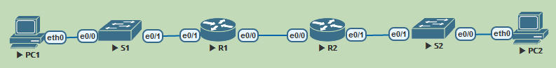

# DHCPv6
**Задачи**
1. Build the Network and Configure Basic Device Settings
2. Verify SLAAC address assignment from R1
3. Configure and verify a Stateless DHCPv6 Server on R1
4. Configure and verify a Stateful DHCPv6 Server on R1
5. Configure and verify a DHCPv6 Relay on R2

**Ход решения**


*Используемая при выполнении работы топология.*

**Адресация в сети**

Устройство | Интерфейс | IPv6-адрес
-|-|-
R1   | G0/0/0 | 2001:db8:acad:2::1 /64
-| G0/0/0 | fe80::1
-| G0/0/1 | 2001:db8:acad:1::1/64
-| G0/0/1 | fe80::1
R2   | G0/0/0 | 2001:db8:acad:2::2/64
-| G0/0/0 | fe80::2
-| G0/0/1 | 2001:db8:acad:3::1 /64
-| G0/0/1 | fe80::1
PC-A | NIC    | DHCP
PC-B | NIC    | DHCP


## Часть 1. Построить сеть и настроить сетевые устройства

### Настроим базовые параметры коммутаторов


Assign a device name to the switch.
```
Switch(config)#hostname S1
```
Disable DNS lookup to prevent the router from attempting to translate incorrectly entered commands as though they were host names.
```
S1(config)#no ip dom look
```
Assign cisco as the VTY password and enable login.
```
S1(config)#line vty 0 4
S1(config-line)#logg syn
S1(config-line)#password thousand
S1(config-line)#login
```
Аналогично для line con 0
Encrypt the plaintext passwords.
```
S1(config)#service password-encryption
```
Create a banner that warns anyone accessing the device that unauthorized access is prohibited.
```
S1(config)#banner motd %
Enter TEXT message.  End with the character '%'.
I'll be the calm
I will be quiet
Stripped to the bone
I wait%
```
Shutdown all unused ports
```
S1(config)#int range e0/2-3
S1(config-if-range)#shut
```
Save the running configuration to the startup configuration file.
```
S1#copy run start
```
Аналогично на втором.

### Настроим базовые параметры маршрутизаторов
Assign a device name to the router.
```
Router(config)#hostname R1
```
Disable DNS lookup to prevent the router from attempting to translate incorrectly entered commands as though they were host names.
```
R1(config)#no ip dom look
```
Assign cisco as the VTY password and enable login.
```
R1(config)#line vty 0 4
R1(config-line)#pass thousand
R1(config-line)#logg syn
R1(config-line)#login
```
Encrypt the plaintext passwords.
```
R1(config)#ser pass
```
Create a banner that warns anyone accessing the device that unauthorized access is prohibited.
```
R1(config)#banner motd %
Enter TEXT message.  End with the character '%'.
I canb^@t control
Withering wonders
Flowers that lose
Their shape%
```
Enable IPv6 Routing
```
R1(config)#ipv6 uni
```
Save the running configuration to the startup configuration file.
```
R1#copy run start
```
Аналогично на втором.

### Настроим интерфейсы и роутинг на обоих роутерах
Укажем адреса в соответствии с таблицей адресации
```
R1(config-if)#int e0/0
R1(config-if)#ipv6 addr 2001:db8:acad:2::1/64
R1(config-if)#ipv6 addr fe80::1 link-local
R1(config-if)#int e0/1
R1(config-if)#ipv6 addr 2001:db8:acad:1::1/64
R1(config-if)#ipv6 addr fe80::1 link-local

R1(config)#ipv6 route ::/0 e0/0 fe80::2
```
И соответственно на R2.
Проверим, как работает.
```
R1#ping 2001:db8:acad:3::1
Type escape sequence to abort.
Sending 5, 100-byte ICMP Echos to 2001:DB8:ACAD:3::1, timeout is 2 seconds:
!!!!!
Success rate is 100 percent (5/5), round-trip min/avg/max = 1/4/19 ms
```
Работает.

## Часть 2. Проверим, как работает SLAAC

```
PC1> ip auto
GLOBAL SCOPE      : 2001:db8:acad:1:2050:79ff:fe66:6803/64
ROUTER LINK-LAYER : aa:bb:cc:00:70:10
```
Префикс хост получил от своего ближайшего роутера, а хостовая часть адреса была сгенерирована из аппаратного адреса по EUI-64. Тут всё понятно.

## Часть 3. Настроим Stateless DHCP на R1
Сперва создадим пул и зададим параметры
```
R1(config)#ipv6 dhcp pool Stateless
R1(config-dhcpv6)#dns-server 2001:db8:acad::254
R1(config-dhcpv6)#domain-name Stateless.com
```
Затем укажем на e0/0 использовать этот пул и передавать флаг для stateles конфигурации.
```
R1(config)#int e0/1
R1(config-if)#ipv6 nd other-config-flag
R1(config-if)#ipv6 dhcp server Stateless
```
Проверим на "ПК" какой адрес был получен.
```
tipa_pc(config-if)#do sh ipv6 int e0/0
Ethernet0/0 is up, line protocol is up
  IPv6 is enabled, link-local address is FE80::A8BB:CCFF:FE00:D000
  No Virtual link-local address(es):
  Stateless address autoconfig enabled
  Global unicast address(es):
    2001:DB8:ACAD:1:A8BB:CCFF:FE00:D000, subnet is 2001:DB8:ACAD:1::/64 [EUI/CAL/PRE]
```
И остальные настройки.
```
tipa_pc#sh ipv6 dhcp int
Ethernet0/0 is in client mode
  Prefix State is IDLE (0)
  Information refresh timer expires in 23:56:44
  Address State is IDLE
  List of known servers:
    Reachable via address: FE80::1
    DUID: 00030001AABBCC007000
    Preference: 0
    Configuration parameters:
      DNS server: 2001:DB8:ACAD::254
      Domain name: Stateless.com
```
## Часть 4. Настроим Stateful DHCP на R1
Теперь создадим другой пул с другими настройками.
```
R1(config)#ipv6 dhcp pool Stateful
R1(config-dhcpv6)#address prefix 2001:db8:acad:3:aaa::/80
R1(config-dhcpv6)#dns-server 2001:db8:acad::254
R1(config-dhcpv6)#domain-name Stateful.com
```
И назначим его на другой интерфейс e0/0 R1, а заодно укажем флаг для stateful конфигурации.
```
R1(config)#int e0/0
R1(config-if)#ipv6 dhcp server Stateful
```
## Часть 5. Настроим рилей на R2
Можем заметить, что сейчас PC2 получает свой префикс от роутера R2.
Соответственно, флаги для конфигурации тоже нужно указать на R2.
```
R2(config)#int e0/1
R2(config-if)#ipv6 nd managed-config-flag
R2(config-if)#ipv6 dhcp relay destination 2001:db8:acad:2::1 e0/0
```
Теперь PC2 должен обращаться за всеми настройками по указанному адресу.
```
tipa_pc2#sh ipv6 int
Ethernet0/0 is up, line protocol is up
  IPv6 is enabled, link-local address is FE80::A8BB:CCFF:FE00:E000
  No Virtual link-local address(es):
  Global unicast address(es):
    2001:DB8:ACAD:3:AAA:788D:EB97:CBEF, subnet is 2001:DB8:ACAD:3:AAA:788D:EB97:CBEF/128
```
А вот и он.
```
R1#sh ipv6 dhcp bin
Client: FE80::A8BB:CCFF:FE00:E000
  DUID: 00030001AABBCC00E000
  Username : unassigned
  VRF : default
  IA NA: IA ID 0x00030001, T1 43200, T2 69120
    Address: 2001:DB8:ACAD:3:AAA:788D:EB97:CBEF
            preferred lifetime 86400, valid lifetime 172800
            expires at Oct 31 2020 07:54 PM (172570 seconds)
```
И проверка связи
```
tipa_pc2#ping 2001:DB8:ACAD:1::1
Type escape sequence to abort.
Sending 5, 100-byte ICMP Echos to 2001:DB8:ACAD:1::1, timeout is 2 seconds:
!!!!!
Success rate is 100 percent (5/5), round-trip min/avg/max = 1/1/1 ms
```

И если добавить на PC1 маршрут по умолчанию, то даже между двумя ПК.
```
tipa_pc#ping  2001:DB8:ACAD:3:AAA:788D:EB97:CBEF
Type escape sequence to abort.
Sending 5, 100-byte ICMP Echos to 2001:DB8:ACAD:3:AAA:788D:EB97:CBEF, timeout is 2 seconds:
!!!!!
Success rate is 100 percent (5/5), round-trip min/avg/max = 1/1/2 ms
```