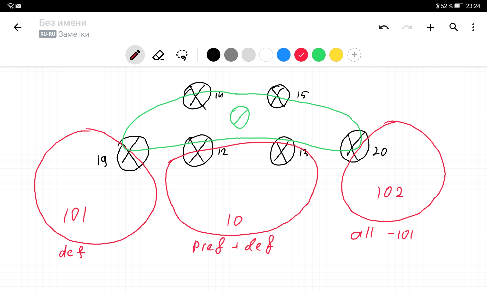
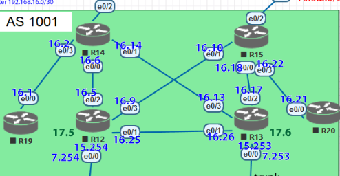

# OSPF


*Рис. 1: План сети*

### Цель:
Настроить OSPF офисе Москва

Разделить сеть на зоны

Настроить фильтрацию между зонами
1. Маршрутизаторы R14-R15 находятся в зоне 0 - backbone
2. Маршрутизаторы R12-R13 находятся в зоне 10. Дополнительно к маршрутам должны получать маршрут по-умолчанию
3. Маршрутизатор R19 находится в зоне 101 и получает только маршрут по умолчанию
4. Маршрутизатор R20 находится в зоне 102 и получает все маршруты, кроме маршрутов до сетей зоны 101
5. Настройка для IPv6 повторяет логику IPv4
6. План работы и изменения зафиксированы в документации 

1 v
2 v
3 v
4
5 v
6

## Деление на зоны

Чтобы избежать изменения топологии сети для создания дополнительной связи в Зоне 0 между R14 и R15, было решено использовать деление на зоны, как изображено на схеме. Маршрутизаторы 12, 13, 14, 15 находятся в зоне 0 и являются пограничными маршрутизаторами для всех остальных зон.

Линк между R12 и R13 находится в зоне 10.

Router-id для каждого маршрутизатора задан вручную в виде `0.0.0.x`, где `x` — номер устройства на схеме.

## Настройка

Прежде всего, на каждом маршрутизаторе включим процессы ospf
```
router ospfv3 10
router ospf 10
```

Укажем `passive-interface default` для обоих процессов и перечислим интерфейсы, связанные с другими маршрутизаторами.

После этого останется лишь добавить интерфейсы к процессам OSPF:



*Рис. 2: Интерфейсы для наглядности*

Маршрутизаторы | R14 | R15 | R12 | R13 | R19 | R20
-|-|-|-|-|-|-
e0/0| A0 | A0 | A10 | A10 | A101 | A102
e0/1| A0 | A0 | A10 | A10| A101 | A102
e0/2| - | - | A0 | A0 | A101 | A102
e0/3| A101 | A102 | A0 | A0 | A101 | A102
