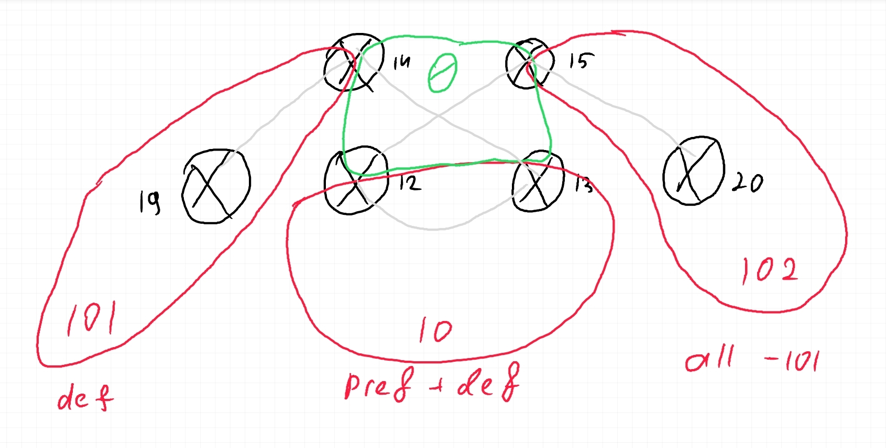

# OSPF


*Рис. 1: План сети*

### Цель:
Настроить OSPF офисе Москва

Разделить сеть на зоны

Настроить фильтрацию между зонами
1. Маршрутизаторы R14-R15 находятся в зоне 0 - backbone
2. Маршрутизаторы R12-R13 находятся в зоне 10. Дополнительно к маршрутам должны получать маршрут по-умолчанию
3. Маршрутизатор R19 находится в зоне 101 и получает только маршрут по умолчанию
4. Маршрутизатор R20 находится в зоне 102 и получает все маршруты, кроме маршрутов до сетей зоны 101
5. Настройка для IPv6 повторяет логику IPv4
6. План работы и изменения зафиксированы в документации

## Деление на зоны

Чтобы избежать изменения топологии сети для создания дополнительной связи в Зоне 0 между R14 и R15, было решено использовать деление на зоны, как изображено на схеме. Маршрутизаторы 12, 13, 14, 15 находятся в зоне 0 и являются пограничными маршрутизаторами для всех остальных зон.

Линк между R12 и R13 находится в зоне 10.

Router-id для каждого маршрутизатора задан вручную в виде `0.0.0.x`, где `x` — номер устройства на схеме.

## Настройка

Прежде всего, на каждом маршрутизаторе включим процессы ospf
```
router ospfv3 10
router ospf 10
```

Укажем `passive-interface default` для обоих процессов и перечислим интерфейсы, связанные с другими маршрутизаторами в виде `no passive-interface Ethernet0/0`.

После этого останется лишь добавить интерфейсы к процессам OSPF:


*Рис. 2: Интерфейсы для наглядности*

Маршрутизаторы | R14 | R15 | R12 | R13 | R19 | R20
-|-|-|-|-|-|-
e0/0| A0 | A0 | A10 | A10 | A101 | A102
e0/1| A0 | A0 | A10 | A10| A101 | A102
e0/2| - | - | A0 | A0 | A101 | A102
e0/3| A101 | A102 | A0 | A0 | A101 | A102

Для этого используется команда конфигурации интерфейса `ip ospf 10 area <x>` и `ipv6 ospf 10 area <x>`.

Этого достаточно, чтобы OSPF начал полноценно работать.

## Фильтрация

Теперь осталось сделать чтобы он начал работать неполноценно.
Согласно заданию, необходимо настроить фильтрацию между областями.

Во-первых, зона 10 должна вдобавок получать маршрут по-умолчанию. Для этого сделаем её тупиковой. На R12 и R13 в режиме конфигурации ospf укажем
```
area 10 stub
```

Во-вторых, зона 101 должна получать только маршрут по-умолчанию. Для этого сделаем её совсем тупиковой. На R19 и R14 укажем `area 101 stub` и дополнительно на R14 добавим `area 101 stub no-summary`.


В-третьих, зона 102 не должна получать префиксы из зоны 101. В той зоне нет никаких клиентских сетей, поэтому в целях демонстрации в рамках лабораторной работы исключим анонс транспортной сети `192.168.16.0/30`.

Лучший способ сделать это — через фильтр префикс-листов. Фильтр будет работать на пограничном маршрутизаторе R15. Сперва создадим сам лист:
```
ip prefix-list a101 seq 5 deny 192.168.16.0/30
ip prefix-list a101 seq 10 permit 0.0.0.0/0 le 32
```
Затем применим его для анонсов входящих в зону 102:
```
area 102 filter-list prefix a101 in
```
Этого должно быть достаточно.

