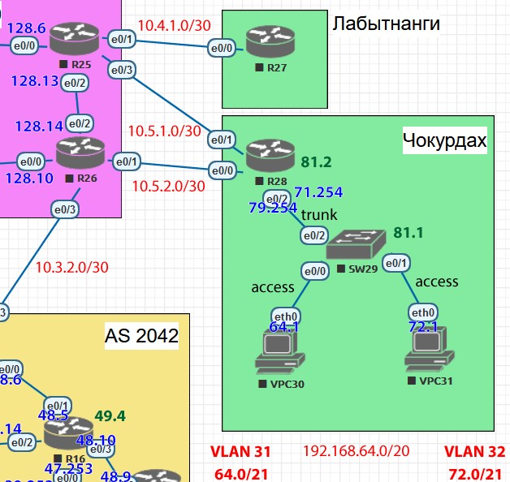
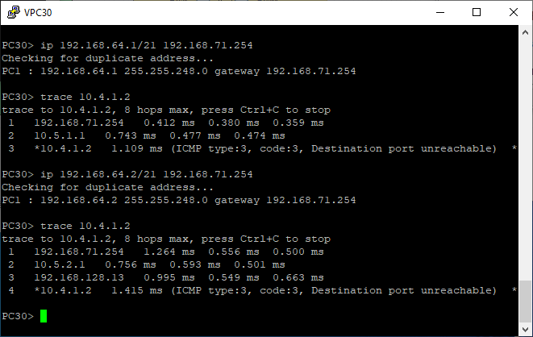
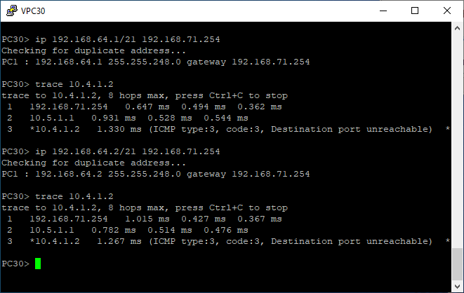

# PBR


*Рис. 1: План работы*

Цель: Настроить политику маршрутизации в офисе Чокурдах
Распределить трафик между 2 линками
В этой самостоятельной работе мы ожидаем, что вы самостоятельно:
1. Настроите политику маршрутизации для сетей офиса
2. Распределите трафик между двумя линками с провайдером
3. Настроите отслеживание линка через технологию IP SLA
4. Настройте для офиса Лабытнанги маршрут по-умолчанию
5. План работы и изменения зафиксированы в документации

# Ход выполнения

## Подготовка
Начнём с офиса в Лабытнаги и укажем для него маршрут по-умолчанию. Вариант всего один.
```
R27(config)#ip route 0.0.0.0 0.0.0.0 10.4.1.1
```

Перейдём в офис в Чокурдах. Здесь нам требуется распределить траффик клиентов по двум внешним линкам, что можно сделать аналогично примеру в лекции, просто разделив всех клиентов по чётности адреса. Для этого можно использовать access list с соответствующей обратной маской.

Для начала добавим на R28 маршрут по-умолчанию через R26 и запасной через R25.

Но перед этим настроим соответствующие два трека, которые нам для этого понадобятся.

Это для R25:
```
R28(config)#ip sla 1
R28(config-ip-sla)#icmp-echo 10.5.1.1 source-ip 10.5.1.2
R28(config-ip-sla-echo)#frequency 10
R28(config)#ip sla sch 1 life forever start-time now
```

Это для R26:
```
R28(config)#ip sla 2
R28(config-ip-sla)#icmp-echo 10.5.2.1 source-ip 10.5.2.2
R28(config-ip-sla-echo)#frequency 10
R28(config)#ip sla sch 2 life forever start-time now
```

Добавим трекинг
```
R28(config)#track 1 ip sla 1 reach
R28(config)#track 2 ip sla 2 reach
```

Нам понадобятся оба.
Теперь можно добавить маршрут по умолчанию: основной через R26 и резервный через R25.
```
ip route 0.0.0.0 0.0.0.0 10.5.2.1 track 2
```
И запасной через R25.
```
ip route 0.0.0.0 0.0.0.0 10.5.1.1 10
```

## Делим траффик
Маршрут по-умолчанию и запасной готовы. Теперь перейдём к разделению траффика.

Отберём нечётные адреса клиентов.

```
ip access-list standard acl-odd
permit 192.168.64.1 0.0.15.254
```

Затем при помощи route-map распределим траффик между между R25 и R26. Здесь и пригодится track 1, чтобы не делить траффик, если резервный канал поломался.

```
route-map Split permit 10
match ip address acl-odd
set ip next-hop verify-availability 10.5.1.1 10 track 1
route-map Split permit 20
set ip next-hop 10.5.2.1
```

Остаётся только назначить route-map на входящий интерфейс. Так как входящих интерфейсов в клиентской сети у нас два, то на оба.

```
R28(config)#int e0/2.31
R28(config-subif)#ip policy route-map Split
R28(config-subif)#int e0/2.32
R28(config-subif)#ip policy route-map Split
```

## Дополнительно
Чтобы проверить работу маршрутизации придётся ещё по крайней мере указать на R25 и R26 маршрут в сеть 192.168.64.0/20
```
R25(config)#ip route 192.168.64.0 255.255.240.0 10.5.1.2
```
А на R26 ещё и на офис в Лабытнаги.
```
R26(config)#ip route 10.4.1.0 255.255.255.252 192.168.128.13
```

# Тесты
Сперва проверим маршрут из офиса в Чокурдах до офиса в Лабытнаги.


*Рис. 2: Тест 1*

Как видно, для разных адресов клиентов траффик направляется через разные маршрутизаторы.

Теперь проверим, что происходит при недоступности некоторых каналов.
Отключать связь R25-R28 нельзя, потому что тогда пришлось бы зарезервировать обрытный маршрут в сеть 192.168.64.0/20, а это уже работа для OSPF, который ещё не настроен. Так что для проверки трекинга должно быть достаточно выхода из строя R26. Просто отключу его.



*Рис. 3: Тест 2*

При отказе R26 весь траффик вне зависимости от происхождения направляется на живой R25.

Конечно, можно предусмотреть более сложные сценарии отказа, но для этого потребуется предусмотреть резервирование маршрутной информации на большем количестве транзитных роутеров, что не является темой этой работы.