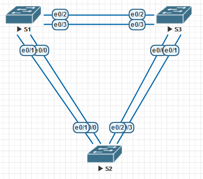
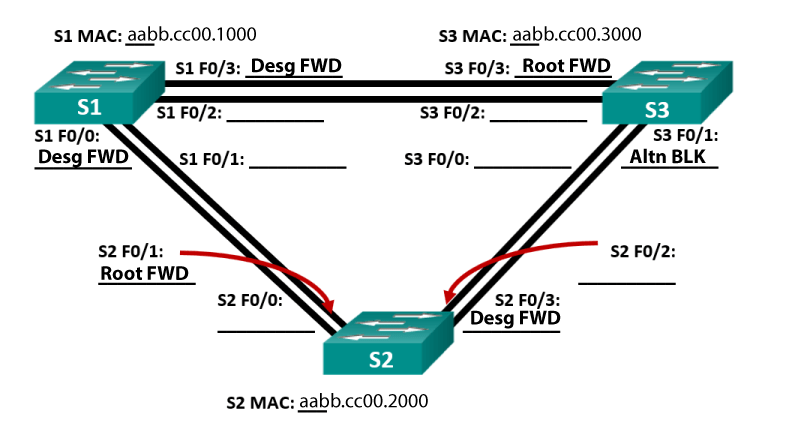

# Развертывание коммутируемой сети с резервными каналами

## **Задачи**
1. Создание сети и настройка основных параметров устройства
2. Выбор корневого моста
3. Наблюдение за процессом выбора протоколом STP порта, исходя из стоимости портов
4. Наблюдение за процессом выбора протоколом STP порта, исходя из приоритета портов

## **Ход решения**

Устройство | Интерфейс | IP-адрес | Маска подсети
-|-|-|-
S1 | VLAN 1 | 192.168.1.1 | 255.255.255.0
S2 | VLAN 1 | 192.168.1.2 | 255.255.255.0
S3 | VLAN 1 | 192.168.1.3 | 255.255.255.0
*Используемая адресация*


*Используемая топология*

### **Создание сети и настройка основных параметров устройства**

Выполним базовую настройку на S1 согласно заданию.

```
Switch>ena
Switch#conf t
Enter configuration commands, one per line.  End with CNTL/Z.
Switch(config)#hostname S1
S1(config)#enable secret class
S1(config)#line con 0
S1(config-line)#logg syn
S1(config-line)#password cisco
S1(config-line)#login
S1(config-line)#exit
S1(config)#line vty 0 4
S1(config-line)#logg syn
S1(config-line)#password cisco
S1(config-line)#login
S1(config-line)#exit
S1(config)#banner motd % this is a MOTD %
S1(config)#banner login % Hello there, general Kenobi %
S1(config)#int vlan 1
S1(config-if)#ip addr 192.168.1.1 255.255.255.0
S1(config-if)#end
S1#copy run start
```

Аналогично настроим S2 и S3

### **Определение корневого моста**

Согласно заданию, отключим все интерфейсы, переведём их в режим trunk, после чего активируем интерфейсы Eth1 и Eth3 на всех коммутаторах.

```
S1(config)#int range et0/0 - 3
S1(config-if-range)#shutdown
S1(config-if-range)#sw mode trunk
S1(config)#int et0/1
S1(config-if)#no shutdown
S1(config-if)#int et0/3
S1(config-if)#no shutdown
```

Выполним аналогичную настройку на двух других коммутаторах.

Выведем информацию о состоянии работы STP с помощью `show span`.
```
S1#show span

VLAN0001
  Spanning tree enabled protocol ieee
  Root ID    Priority    32769
             Address     aabb.cc00.1000
             This bridge is the root
             Hello Time   2 sec  Max Age 20 sec  Forward Delay 15 sec

  Bridge ID  Priority    32769  (priority 32768 sys-id-ext 1)
             Address     aabb.cc00.1000
             Hello Time   2 sec  Max Age 20 sec  Forward Delay 15 sec
             Aging Time  300 sec

Interface           Role Sts Cost      Prio.Nbr Type
------------------- ---- --- --------- -------- --------------------------------
Et0/1               Desg FWD 100       128.2    P2p
Et0/3               Desg FWD 100       128.4    P2p
```

```
S2#show span

VLAN0001
  Spanning tree enabled protocol ieee
  Root ID    Priority    32769
             Address     aabb.cc00.1000
             Cost        100
             Port        2 (Ethernet0/1)
             Hello Time   2 sec  Max Age 20 sec  Forward Delay 15 sec

  Bridge ID  Priority    32769  (priority 32768 sys-id-ext 1)
             Address     aabb.cc00.2000
             Hello Time   2 sec  Max Age 20 sec  Forward Delay 15 sec
             Aging Time  300 sec

Interface           Role Sts Cost      Prio.Nbr Type
------------------- ---- --- --------- -------- --------------------------------
Et0/1               Root FWD 100       128.2    P2p
Et0/3               Desg FWD 100       128.4    P2p
```

```
S3#show span

VLAN0001
  Spanning tree enabled protocol ieee
  Root ID    Priority    32769
             Address     aabb.cc00.1000
             Cost        100
             Port        4 (Ethernet0/3)
             Hello Time   2 sec  Max Age 20 sec  Forward Delay 15 sec

  Bridge ID  Priority    32769  (priority 32768 sys-id-ext 1)
             Address     aabb.cc00.3000
             Hello Time   2 sec  Max Age 20 sec  Forward Delay 15 sec
             Aging Time  300 sec

Interface           Role Sts Cost      Prio.Nbr Type
------------------- ---- --- --------- -------- --------------------------------
Et0/1               Altn BLK 100       128.2    P2p
Et0/3               Root FWD 100       128.4    P2p
```



Почему этот коммутатор был выбран протоколом spanning-tree в качестве корневого моста?<br>
*Потому что имеет наименьший аппаратный адрес.*<br>
Какие порты на коммутаторе являются корневыми портами?<br>
*Eth1 на S2 и Eth3 на S3.*<br>
Какие порты на коммутаторе являются назначенными портами?<br>
*Eth1 и 3 на S1 и Eth3 на S2.*<br>
Какой порт отображается в качестве альтернативного и в настоящее время заблокирован?<br>
*Eth1 на S3.*<br>
Почему протокол spanning-tree выбрал этот порт в качестве невыделенного (заблокированного) порта?<br>
*Потому что этот альтернативный маршрут до корневого коммутатора имеет большую стоимость, чем активный.*<br>

### **Наблюдение за процессом выбора протоколом STP порта, исходя из стоимости портов**

В настоящий момент заблокирован интерфейс Eth0/1 на S3. Снизим стоимость второго и посмотрим, что произойдёт.

```
S3(config)#int et0/3
S3(config-if)#span cost 90
```
```
S3(config)#do show span

VLAN0001
  Spanning tree enabled protocol ieee
  Root ID    Priority    32769
             Address     aabb.cc00.1000
             Cost        90
             Port        4 (Ethernet0/3)
             Hello Time   2 sec  Max Age 20 sec  Forward Delay 15 sec

  Bridge ID  Priority    32769  (priority 32768 sys-id-ext 1)
             Address     aabb.cc00.3000
             Hello Time   2 sec  Max Age 20 sec  Forward Delay 15 sec
             Aging Time  300 sec

Interface           Role Sts Cost      Prio.Nbr Type
------------------- ---- --- --------- -------- --------------------------------
Et0/1               Desg FWD 100       128.2    P2p
Et0/3               Root FWD 90        128.4    P2p
```
```
S2#show span

VLAN0001
  Spanning tree enabled protocol ieee
  Root ID    Priority    32769
             Address     aabb.cc00.1000
             Cost        100
             Port        2 (Ethernet0/1)
             Hello Time   2 sec  Max Age 20 sec  Forward Delay 15 sec

  Bridge ID  Priority    32769  (priority 32768 sys-id-ext 1)
             Address     aabb.cc00.2000
             Hello Time   2 sec  Max Age 20 sec  Forward Delay 15 sec
             Aging Time  15  sec

Interface           Role Sts Cost      Prio.Nbr Type
------------------- ---- --- --------- -------- --------------------------------
Et0/1               Root FWD 100       128.2    P2p
Et0/3               Altn BLK 100       128.4    P2p
```

Как мы можем теперь видеть, из-за более низкой стоимости порты поменялись местами, но я понятия не имею, что это значит, ведь в топологии ничего не изменилось, а значит, этот пункт, скорее всего, можно проигнорировать.

После возврата стоимости по умолчанию командой `no span cost` ситуация возвращается в состояние как было.

### **Наблюдение за процессом выбора протоколом STP порта, исходя из приоритета портов**

Для начала активируем все отключенные интерфейсы на всех коммутаторах.
```
S1(config)#int range et0/0 - 3
S1(config-if-range)#no shutdown
```

После этого роль интерфейсов переназначается.
```
S2(config-if-range)#do show span
<...>

Interface           Role Sts Cost      Prio.Nbr Type
------------------- ---- --- --------- -------- --------------------------------
Et0/0               Root FWD 100       128.1    P2p
Et0/1               Altn BLK 100       128.2    P2p
Et0/2               Desg FWD 100       128.3    P2p
Et0/3               Desg FWD 100       128.4    P2p
```
```
S3(config-if-range)#do show span
<...>

Interface           Role Sts Cost      Prio.Nbr Type
------------------- ---- --- --------- -------- --------------------------------
Et0/0               Altn BLK 100       128.1    P2p
Et0/1               Altn BLK 100       128.2    P2p
Et0/2               Root FWD 100       128.3    P2p
Et0/3               Altn BLK 100       128.4    P2p
```

В данном случае интерфейс с более низким номером имеет более высокий приоритет, а все остальные становятся альтернативными.

## **Итого**

После назначения корневого моста для выбора портов используются по порядку следующие величины:
1. Стоимость. Интерфейс, через который проходит путь до корня с минимальной стоимостью становится корневым.
2. Bridge Priority. При равной стоимости интерфейс на коммутаторе с более маленьким значением Priority будет иметь более высокий приоритет.
3. Приоритет интерфейса. При прочих равных интерфейс с меньшим номером будет иметь более высокий приоритет.