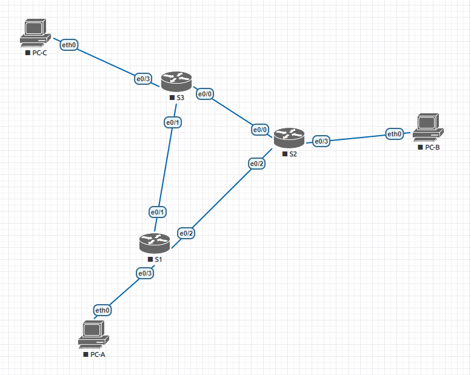
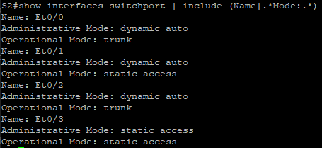
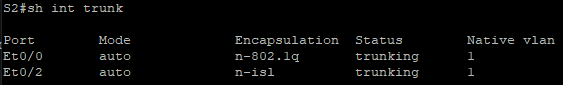

# Настройка расширенных сетей VLAN, VTP и DTP
**Задачи**
1. Настройка VTP
2. Настройка DTP
3. Добавление сетей VLAN и назначение портов
4. Настройка расширенной сети VLAN

**Ход решения**


*Используемая при выполнении работы топология.*

**Адресация в сети**

Устройство | VLAN | IP-адрес | Маска подсети
-|-|-|-
S1 | VLAN 99 | 192.168.99.1 | 255.255.255.0
S2 | VLAN 99 | 192.168.99.2 | 255.255.255.0
S3 | VLAN 99 | 192.168.99.3 | 255.255.255.0
PC-A | - | 192.168.10.1 | 255.255.255.0
PC-B | - | 192.168.20.1 | 255.255.255.0
PC-C | - | 192.168.10.2 | 255.255.255.0

**Настройка VTP на коммутаторах**

Протокол VTP служит для централизованного динамического управления конфигурацией VLAN на коммутаторах.

По-умолчанию коммутаторы работают в режиме сервера VTP для того, чтобы на них было возможно производить индивидуальную настройку VLAN. Для работы протокола VTP необходимо создать домен VTP и оставить в нём только один коммутатор функционирующий в режиме сервера, а остальные перевести в режим клиента или в прозрачный режим. Также для дополнительной безопасности можно указать пароль для этого домена.

Пусть S2 будет работать в режиме сервера. Для настройки необходимо выполнить на всех трёх коммутаторах следующие команды в режиме конфигурации:

```
S2# vtp domain CCNA
S2# vtp password cisco
```

Кроме этого необходимо S1 и S3 переключить в режим клиента командой
```
S1# vtp mode client
```

Проверить состояние VTP можно при помощи команды
```
S2# show vtp status
```
в этом как его там режиме, котрый не конфигурации.

**Настройка DTP**

Протокол DTP позволяет автоматически настраивать магистральные каналы между соседними коммутаторами в сети.

По умолчанию все интерфейсы находятся в режиме согласования `dynamic auto`, что приводит к тому, что интерфейсы работают в режиме доступа. Для перевода интерфейсов в режим `trunk` необходимо либо включить на одной из сторон режим согласования `dynamic desirable`, либо статический `trunk`.

Согласно заданию, требуется настроить динамический магистральный канал между S1 и S2, а также, статический между S1—S3 и S2—S3.

```
S1(config)# int et0/2
S1(config-if)# sw mode dyn des
```

и остальные

```
S3(config)# int et0/0
S3(config-if)# sw mode trunk
S3(config-if)# exit
S3(config)# int et0/1
S3(config-if)# sw mode trunk
```

Проверить результат конфигурации можно, например так.




**Добавление сетей VLAN и назначение портов**

Далее добавим сети vlan. Это необходимо делать на коммутаторе S2, потому что он единственный находится в режиме сервера VTP.

```
S2(config)# vlan 10
S2(config-vlan)# name Red
S2(config-vlan)# vlan 20
S2(config-vlan)# name Blue
S2(config-vlan)# vlan 30
S2(config-vlan)# name Yellow
S2(config-vlan)# vlan 99
S2(config-vlan)# name Management
```

Коммутаторы S1 и S3 получат эту конфигурацию автоматически. Проверить текущую конфигурацию vlan на коммутаторе можно командой `show vlan`.

Далее следует указать разрешённые vlan для access интерфейсов. Они уже находятся в режиме static access, так что дополнительная настройка клиентских интерфейсов не требуется, но в целях безопасности можно переключить интерфейсы Et0/3 на всех коммутаторах в принудительный access mode.

```
S1(config)# int et0/3
S1(config-if)# sw mode acc
S1(config-if)# sw acc vlan 10
S2(config)# int et0/3
S2(config-if)# sw mode acc
S2(config-if)# sw acc vlan 10
S3(config)# int et0/3
S3(config-if)# sw mode acc
S3(config-if)# sw acc vlan 10
```

Остаётся настроить адрес на виртуальном интерфейсе коммутаторов.

```
S1(config)# interface vlan 99
S1(config-if)# ip address 192.168.99.1 255.255.255.0
S1(config-if)# no shutdown
S2(config)# interface vlan 99
S2(config-if)# ip address 192.168.99.2 255.255.255.0
S2(config-if)# no shutdown
S3(config)# interface vlan 99
S3(config-if)# ip address 192.168.99.3 255.255.255.0
S3(config-if)# no shutdown
```

После этого можно проверять связь.
В данной конфигурации возможно соединение только между виртуальными интерфейсами коммутаторов, а также между PC-A и PC-C, потому что переходы пакетов между сетями невозможны, так как у нас отсутствует маршрутизация.

**Настройка сети VLAN расширенного диапазона**

Для использования расширенных VLAN, выходящих за пределы номера 1025 необходимо отказаться от VTP, который их не поддерживает. Для этого коммутаторы, на которых подразумевается использование расширенного диапазона, следует перевести в прозрачный режим командой `vtp mode transparent`. При этом имеющаяся конфигурация VLAN сохранится, но устройство больше не будет получать динамические обновления VTP от сервера.