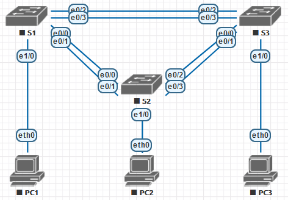
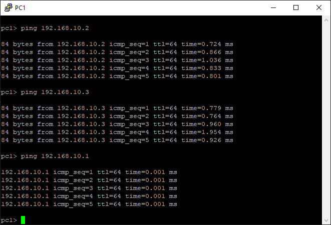

# Настройка EtherChannel

## Задачи
1. Настройка базовых параметров коммутатора
2. Настройка PAgP
3. Настройка LACP

## Топология


Устройство | Интерфейс | IP-адрес | Маска подсети
-|-|-|-
S1 | VLAN 99 | 192.168.1.1 | 255.255.255.0
S2 | VLAN 99 | 192.168.1.2 | 255.255.255.0
S3 | VLAN 99 | 192.168.1.3 | 255.255.255.0
PC1 | NIC | 192.168.10.1 | 255.255.255.0
PC2 | NIC | 192.168.10.2 | 255.255.255.0
PC3 | NIC | 192.168.10.3 | 255.255.255.0

## Часть 1
Настроим базыве параметры коммутаторов.

Отключить поиск DNS
```
no ip domain lookup
```
Имя устройства
```
hostname S1
```
Зашифруйте пароли
```
service password-encryption
```
Создайте баннерное сообщение MOTD
```
banner motd % Hello there, unidentified user %
```
Настроить логирование в консоли
```
line con 0
logging synchronous
```
Отключите все порты коммутаторов, кроме портов, подключенных к компьютерам
```
int range e0/0-3
shutdown
int range e1/1-3
shutdown
```
Настройте сети vlan
```
vlan 99
name management
vlan 10
name staff
```
Настройте порты коммутатора с присоединёнными узлами в качестве портов доступа vlan 10
```
int e1/0
sw mode acc
sw acc vlan 10
```
Назначьте IP адреса в соответствии с таблицей
```
int vlan 99
ip addr 192.168.99.11 255.255.255.0
```
Сохраните текущую конфигурацию
```
wr
```

## Часть 2
**Настройка PAgP на S1 и S3**

Настроим S1 для использования режима связи desirable, а S3 в режиме auto. В режиме `desirable` EtherChannel создаётся с использованием протокола PAgP.

```
S1(config)#int range e0/2-3
S1(config-if-range)#channel-group 1 mode desirable
S1(config-if-range)#no shutdown

S3(config)#int range e0/2-3
S3(config-if-range)#channel-group 1 mode auto
S3(config-if-range)#no shutdown
```
Сразу создаётся новый интерфейс Port-channel1
```
%LINK-3-UPDOWN: Interface Port-channel1, changed state to up
%LINEPROTO-5-UPDOWN: Line protocol on Interface Port-channel1, changed state to up
```

**Настроим транковые порты**
```
S3(config)#int po1
S3(config-if)#sw trunk enc dot1q
S3(config-if)#sw mode trunk
```

**Проверим конфигурацию**

Проверим состояние интерфейсов
```
S3#sh int e0/3 sw | in Name|Mode
Name: Et0/3
Administrative Mode: trunk
Operational Mode: trunk (member of bundle Po1)
```
Проверим состояние линка EtherChannel
```
S3#sh etherchannel summary
<..>
Group  Port-channel  Protocol    Ports
------+-------------+-----------+-----------------------------------------------
1      Po1(SU)         PAgP      Et0/2(P)    Et0/3(P)
```
Символ `P` означает, что интерфейс находится в составе агрегированного канала. Символ `S` означает, что новый интерфейс действет на канальном уровне. Символ `U` означает, что канал используется.

Из сравнения вывод команд `show run int e0/2-3` и `show run int port-channel 1` видно, что для интерфейсов входящих в состав агрегированного канала были применены те же настройки, что и для целого канала.
```
S1#show run int e0/3

interface Ethernet0/3
 switchport trunk encapsulation dot1q
 switchport trunk native vlan 99
 switchport mode trunk
 channel-group 1 mode desirable
end
```

Для `show int trunk` и `show spanning-tree` в качестве активного интерфейса фигурирует только агрегированный интерфейс Po1.
Стоимость перехода для STP составляет 56, что приблизительно и соответствует суммарной скорости 20 Мбит/с.

## Часть 3
**Настройка протокола LACP**
```
S1(config)#int range e0/0-1
S1(config-if-range)#channel-group 2 mode passive
S1(config-if-range)#int po2
S1(config-if)#sw trunk enc dot1q
S1(config-if)#sw trunk native vlan 99
S1(config-if)#sw mode trunk
S1(config-if)#no shut
```
Аналогично на S2 и S3.
В режиме `auto` EtherChannel конфигурируется по протоколу LACP.
Убедиться в работе можно при помощи команды `show etherchannel summary`:
```
Group  Port-channel  Protocol    Ports
------+-------------+-----------+-----------------------------------------------
1      Po1(SD)          -
2      Po2(SU)         LACP      Et0/0(P)    Et0/1(P)
3      Po3(SU)         LACP      Et0/2(P)    Et0/3(P)
```

**Проверка**

Остаётся активировать access порты и проверить связь между конечными узлами.



Всё работает.