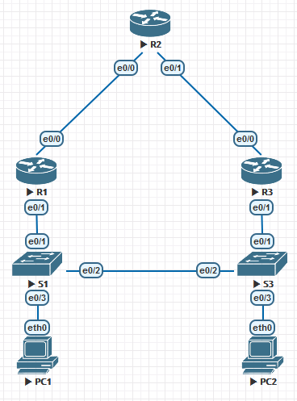
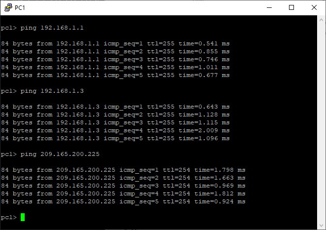

# Настройка HSRP

## Задачи
1. Построение сети и проверка соединения
2. Настройка обеспечения избыточности на первом хопе с помощью HSRP

## Топология


Устройство | Интерфейс | IP-адрес | Маска подсети | Шлюз по умолчанию
-|-|-|-|-
R1 | G0/1 | 192.168.1.1 | 255.255.255.0 |
|| S0/0/0 (DCE) | 10.1.1.1 | 255.255.255.252 |
R2 | S0/0/0 | 10.1.1.2 | 255.255.255.252 |
|| S0/0/1 (DCE) | 10.2.2.2 | 255.255.255.252 |
|| Lo1 | 209.165.200.225 | 255.255.255.224 |
R3 | G0/1 | 192.168.1.3 | 255.255.255.0 |
|| S0/0/1 | 10.2.2.1 | 255.255.255.252 |
S1 | VLAN 1 | 192.168.1.11 | 255.255.255.0 | 192.168.1.1
S3 | VLAN 1 | 192.168.1.13 | 255.255.255.0 | 192.168.1.3
PC1 | NIC | 192.168.1.31 | 255.255.255.0 | 192.168.1.1
PC3 | NIC | 192.168.1.33 | 255.255.255.0 | 192.168.1.3

## Часть 1: Построение сети и проверка связи

**Произведите базовую настройку маршрутизаторов.**
```
a.	Отключите поиск DNS.
b.	Присвойте имена устройствам в соответствии с топологией.
c.	Настройте IP-адреса для маршрутизаторов, указанных в таблице адресации.
d.	Установите тактовую частоту на 128000 для всех последовательных интерфейсов маршрутизатора DCE.
e.	Назначьте class в качестве зашифрованного пароля доступа к привилегированному режиму.
f.	Назначьте cisco в качестве пароля консоли и VTY и включите запрос пароля при подключении.
g.	Настройте logging synchronous, чтобы сообщения от консоли не могли прерывать ввод команд.
h.	Скопируйте текущую конфигурацию в файл загрузочной конфигурации.
```
**Настройте базовые параметры каждого коммутатора**
```
a.	Отключите поиск DNS.
b.	Присвойте имена устройствам в соответствии с топологией.
c.	Назначьте class в качестве зашифрованного пароля доступа к привилегированному режиму.
d.	Настройте IP-адреса для коммутаторов, указанных в таблице адресации.
e.	На каждом коммутаторе настройте шлюз по умолчанию.
f.	Назначьте cisco в качестве пароля консоли и VTY и включите запрос пароля при подключении.
g.	Настройте logging synchronous, чтобы сообщения от консоли не могли прерывать ввод команд.
h.	Скопируйте текущую конфигурацию в файл загрузочной конфигурации.
```
**Отправьте ping-запрос с компьютера PC-A на компьютер PC-C. Удалось ли получить ответ?**

Удалось.

**Настройте маршрутизацию.**

Настроим RIPv2. Например на R2 Это будет выглядеть так:
```
R2(config)#router rip
R2(config-router)#version 2
R2(config-router)#network 10.1.1.2
R2(config-router)#network 10.2.2.2
R2(config-router)#end
```
Добавим на R2 маршрут по умолчанию и так как у нас нет адреса next hop шлюза, будем надеяться, что линк p2p.
```
R2(config)#ip route 0.0.0.0 0.0.0.0 eth0/2
```
Распространим маршрут по умолчанию
```
R2(config-router)# default-information originate
```
Проверим связь.



Кажется, всё в порядке.

## Часть 2: Настройка обеспечения избыточности на первом хопе с помощью HSRP

Проверим маршрут пакетов от PC1 до "интернета".
```
pc1> trace 209.165.200.225
trace to 209.165.200.225, 8 hops max, press Ctrl+C to stop
 1   192.168.1.1   1.918 ms  0.526 ms  0.538 ms
 2   *10.1.1.2   1.630 ms (ICMP type:3, code:3, Destination port unreachable)  *
 ```
Идёт через R1 как и положено.

От PC3 идёт через R3, как и положено.
```
pc2> trace 209.165.200.225
trace to 209.165.200.225, 8 hops max, press Ctrl+C to stop
 1   192.168.1.3   1.398 ms  0.725 ms  0.629 ms
 2   *10.2.2.2   1.615 ms (ICMP type:3, code:3, Destination port unreachable)  *
```

Если во время эхо-тестирования разорвать связь между S1 и R1 адрес назначения становится ожидаемо недоступен.

Теперь настроим HSRP на R1 и R3
```
R1(config)#int e0/1
R1(config-if)#standby ver 2
R1(config-if)#standby 1 ip 192.168.1.254
R1(config-if)#standby 1 priority 150
R1(config-if)#standby 1 preempt
```
```
R3(config)#int e0/1
R3(config-if)#standby ver 2
R3(config-if)#standby 1 ip 192.168.1.254
```

Теперь проверим состояние с помощью `show standby`.
Активным является R1, R3 в режиме Standby из-за более низкого приоритета (по умолчанию приоритет 100).
Для виртуального роутера используется MAC адрес 0000.0c9f.f001 и IP адрес 192.168.1.254.

Запросим сводку состояния при помощи `show standby brief`
```
R1>show standby brief
                     P indicates configured to preempt.
                     |
Interface   Grp  Pri P State   Active          Standby         Virtual IP
Et0/1       1    150 P Active  local           192.168.1.3     192.168.1.254
```
```
R3>show standby brief
                     P indicates configured to preempt.
                     |
Interface   Grp  Pri P State   Active          Standby         Virtual IP
Et0/1       1    100   Standby 192.168.1.1     local           192.168.1.254
```

Теперь пора заменить шлюзы по умолчанию на новый адрес 192.168.1.254 на PC1, PC3, S1 и S3.
Проверим связь. Ответ на запрос от PC1 до адреса 209.165.200.225 есть.

Теперь разорвём линию связи между S1 и R1 и проверим ещё раз. Связи нет. Потому что R2 почему-то всё ещё пытается отвечать на запрос через всё ещё активный R1, хотя и получил пакет с другого интерфейса. Стоит разорвать линию между R1 и R2 и связь снова появляется.

Решить это можно при помощи команды `standby 1 track e0/1 100`, которая понизит приоритет роутера на указанное значение в случае отказа указанного интерфейса, позволив ему перейти в режим standby и перестать отвечать на запросы, на которые он не должен отвечать.

Если изменить приоритет R3 на 200, он не станет активным, если не указать для него `standby preempt`. Маршрутизатор становится активным по более высокому приоритету только при указании для него этой команды.

