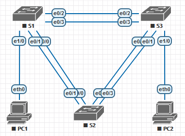

# Поиск и устранение неполадок в работе EtherChannel

## Задачи
1. Построение сети и загрузка настроек устройств
2. Отладка EtherChannel

## Топология


Устройство | Интерфейс | IP-адрес | Маска подсети
-|-|-|-
S1 | VLAN 99 | 192.168.1.11 | 255.255.255.0
S2 | VLAN 99 | 192.168.1.12 | 255.255.255.0
S3 | VLAN 99 | 192.168.1.13 | 255.255.255.0
PC1 | NIC | 192.168.0.2 | 255.255.255.0
PC2 | NIC | 192.168.0.3 | 255.255.255.0

VLAN | Имя
-|-
10 | User
99 | Управление

## Часть 1
**Построение сети и загрузка настроек устройств**

Загрузим на коммутаторы начальную конфигурацию в соответствии с заданием.
(Изменены названия интерфейсов для того, чтобы оно вообще заработало на этих образах)

**S1**
```
hostname S1
interface range e0/0-3, e1/0-3
shutdown
exit
enable secret class
no ip domain lookup
line vty 0 15
password cisco
login
line con 0
 password cisco
 logging synchronous
 login
 exit
vlan 10
 name User
vlan 99
 Name Management
interface range e0/0-1
 switchport mode trunk
 channel-group 1 mode active
 switchport trunk native vlan 99
 no shutdown
interface range e0/2-3
 channel-group 2 mode desirable
 switchport trunk native vlan 99
 no shutdown
interface e1/0
 switchport mode access
 switchport access vlan 10
 no shutdown
interface vlan 99
 ip address 192.168.1.11 255.255.255.0
interface port-channel 1
 switchport trunk native vlan 99
 switchport mode trunk
interface port-channel 2
 switchport trunk native vlan 99
 switchport mode access
```
**S2**
```
hostname S2
interface range e0/0-3
 shutdown
 exit
enable secret class
no ip domain lookup
line vty 0 15
 password cisco
 login
line con 0
 password cisco
 logging synchronous
 login
 exit
vlan 10
 name User
vlan 99
 name Management
spanning-tree vlan 1,10,99 root primary
interface range e0/0-1
 switchport mode trunk
 channel-group 1 mode desirable
 switchport trunk native vlan 99
 no shutdown
interface range e0/2-3
 switchport mode trunk
 channel-group 3 mode desirable
 switchport trunk native vlan 99
interface vlan 99
 ip address 192.168.1.12 255.255.255.0
interface port-channel 1
 switchport trunk native vlan 99
 switchport trunk allowed vlan 1,99
interface port-channel 3
 switchport trunk native vlan 99
 switchport trunk allowed vlan 1,10,99
 switchport mode trunk
```
**S3**
```
hostname S3
interface range e0/0-3, e1/0-3
 shutdown
 exit
enable secret class
no ip domain lookup
line vty 0 15
 password cisco
 login
line con 0
 password cisco
 logging synchronous
 login
 exit
vlan 10
 name User
vlan 99
 name Management
interface range e0/0-1
interface range e0/2-3
 switchport mode trunk
 channel-group 3 mode desirable
 switchport trunk native vlan 99
 no shutdown
interface e1/0
 switchport mode access
 switchport access vlan 10
 no shutdown
interface vlan 99
 ip address 192.168.1.13 255.255.255.0
interface port-channel 3
 switchport trunk native vlan 99
 switchport mode trunk
```

Сохраним эту конфигурацию.

## Часть 2
**Поиск и устранение неисправностей в работе EtherChannel**

Команда `sh int trunk` на S1 не выводит буквально ничего. Следовательно, на коммутаторе нет ни одного активного интерфейса, работающего в режиме trunk.
Вывод команды `sh etherchannel summary` показывает, что порты объединены в канал, но первый почему-то приостановлен.
```
Group  Port-channel  Protocol    Ports
------+-------------+-----------+-----------------------------------------------
1      Po1(SD)         LACP      Et0/0(s)    Et0/1(s)
2      Po2(SU)         PAgP      Et0/2(P)    Et0/3(P)
```
По итогу `sh run | begin interface Port-channel` видно, что Po2 в режиме access, а всё остальное в порядке.
```
S1#sh run | begin interface Port-channel
interface Port-channel1
 switchport trunk encapsulation dot1q
 switchport trunk native vlan 99
 switchport mode trunk
!
interface Port-channel2
 switchport trunk native vlan 99
 switchport mode access
```
Переключим его в правильный режим работы и перейдём к соседу.
```
S1(config)#int po2
S1(config-if)#sw trunk enc dot1q
S1(config-if)#sw mode trunk
```

На S2 `sh trunk` не показывает аггрегированных каналов. Что-то пошло не так.
```
Port        Mode             Encapsulation  Status        Native vlan
Et0/0       on               802.1q         trunking      99
Et0/1       on               802.1q         trunking      99
```
Далее, `sh etherchannel summ` показывает вообще странные вещи.
```
Group  Port-channel  Protocol    Ports
1      Po1(SD)         PAgP      Et0/0(I)    Et0/1(I)
3      Po3(SD)         PAgP      Et0/2(D)    Et0/3(D)
```
Оба Etherchannel down, E0/0 и E0/1 работают независимо. Видно, что не согласованы протоколы с двух сторон Po1. Переключим Po1 в режим Active.
```
S2(config-if-range)#no channel-group 1 mode desirable
S2(config-if-range)#channel-group 1 mode active
```
Здесь вроде всё, перейдём на S3.
```
S3#sh int trunk

Port        Mode             Encapsulation  Status        Native vlan
Po3         on               802.1q         trunking      99

S3#sh etherchannel summ
Group  Port-channel  Protocol    Ports
------+-------------+-----------+-----------------------------------------------
3      Po3(SU)         PAgP      Et0/2(P)    Et0/3(P)
```
Транк один есть до S1 и он работает. Port-channel создан только один и он работает. Нет канала до S2. Забыли создать?

По команде `sh run | begin interface Port-channel` видно, что дейстивтельно забыли, а E0/0 и E0/1 отключены. Исправим это. На S2 канал работает в `desirable`, значит нам понадобится либо `desirable` либо `auto`.
```
S3(config)#int range e0/0-1
S3(config-if-range)#channel-group 1 mode desirable
Creating a port-channel interface Port-channel 1
S3(config-if-range)#no shut
S3(config-if-range)#int po1
S3(config-if)#sw trunk enc dot1q
S3(config-if)#sw trunk native vlan 99
S3(config-if)#sw mode trunk
S3(config-if)#no shut
```
Остаётся только включить забытые интерфейсы на S2
```
S2(config)#int range e0/2-3
S2(config-if-range)#no shut
```
Теперь всё хорошо
```
S3#sh etherchannel summ

Group  Port-channel  Protocol    Ports
------+-------------+-----------+-----------------------------------------------
1      Po1(SU)         PAgP      Et0/0(P)    Et0/1(P)
3      Po3(SU)         PAgP      Et0/2(P)    Et0/3(P)

S3#sh int trunk

Port        Mode             Encapsulation  Status        Native vlan
Po1         on               802.1q         trunking      99
Po3         on               802.1q         trunking      99
```

**Проверим связь между узлами.**

Между двумя пк связь появилась. Однако сеть управления всё ещё не работает.
Потому что, как я узнал сегодня, loopback может быть administratively down. Исправим.
```
int vlan 99
no shut
```
Теперь всё работает.