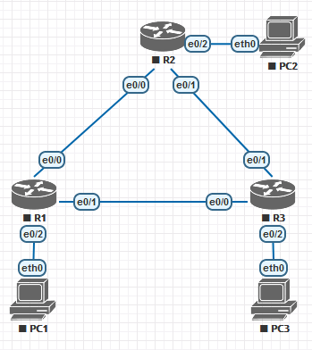

# Настройка базового протокола OSPFv2 для одной области

## Задачи
1. Создание сети и настройка основных параметров устройства
2. Настройка и проверка маршрутизации OSPF
3. Изменение назначений идентификаторов маршрутизаторов
4. Настройка пассивных интерфейсов OSPF
5. Изменение метрик OSPF

## Топология


Устройство | Интерфейс | IP-адрес | Маска подсети | Шлюз по умолчанию
-|-|-|-|-
R1 | e0/2 | 192.168.1.1 | 255.255.255.0 |
|| e0/0 | 192.168.12.1 | 255.255.255.252 |
|| e0/1 | 192.168.13.1 | 255.255.255.252 |
R2 | e0/2 | 192.168.2.1 | 255.255.255.0 |
|| e0/0 | 192.168.12.2 | 255.255.255.252 |
|| e0/1 | 192.168.23.1 | 255.255.255.252 |
R3 | e0/2 | 192.168.3.1 | 255.255.255.0 |
|| e0/0 | 192.168.13.2 | 255.255.255.252 |
|| e0/1 | 192.168.23.2 | 255.255.255.252 |
PC1 | NIC | 192.168.1.3 | 255.255.255.0 | 192.168.1.1
PC2 | NIC | 192.168.2.3 | 255.255.255.0 | 192.168.2.1
PC3 | NIC | 192.168.3.3 | 255.255.255.0 | 192.168.3.1

## Часть 1: Построение сети и проверка связи

Выполним базовую настройку маршрутизаторов и настроим ПК в соответствии с топологией и таблицей адресации. Затем убедимся в наличии связи между маршрутизаторами и между ПК и соответствующими им шлюзами.

## Часть 2: Настройка и проверка маршрутизации OSPF

Настроим OSPF на R1. Активируем процесс и добавим интерфейсы, участвующие в обмене.
```
R1(config)#router ospf 1
R1(config-router)#network 192.168.1.1 0.0.0.0 area 0
R1(config-router)#network 192.168.12.1 0.0.0.0 area 0
R1(config-router)#network 192.168.13.1 0.0.0.0 area 0
```
Аналогично выполним настройку на R2 и R3.

В процессе настройки можно будет наблюдать успешное установление отношений соседства между роутерами.
```
*Aug  6 10:27:47.114: %OSPF-5-ADJCHG: Process 1, Nbr 192.168.23.1 on Ethernet0/0 from LOADING to FULL, Loading Done

*Aug  6 10:29:16.452: %OSPF-5-ADJCHG: Process 1, Nbr 192.168.23.2 on Ethernet0/1 from LOADING to FULL, Loading Done
```
Увидеть активных соседей можно командой `show ip ospf neighbors`.
```
R1#sh ip ospf neigh

Neighbor ID     Pri   State           Dead Time   Address         Interface
192.168.23.2      1   FULL/BDR        00:00:31    192.168.13.2    Ethernet0/1
192.168.23.1      1   FULL/BDR        00:00:38    192.168.12.2    Ethernet0/0
```
Проверить только расространяемые маршруты в таблице маршрутизации можно, добавив `ospf` к обычному запросу.
```
R1#sh ip route ospf
Codes: L - local, C - connected, S - static, R - RIP, M - mobile, B - BGP
       D - EIGRP, EX - EIGRP external, O - OSPF, IA - OSPF inter area
       N1 - OSPF NSSA external type 1, N2 - OSPF NSSA external type 2
       E1 - OSPF external type 1, E2 - OSPF external type 2
       i - IS-IS, su - IS-IS summary, L1 - IS-IS level-1, L2 - IS-IS level-2
       ia - IS-IS inter area, * - candidate default, U - per-user static route
       o - ODR, P - periodic downloaded static route, H - NHRP, l - LISP
       a - application route
       + - replicated route, % - next hop override

Gateway of last resort is not set

O     192.168.2.0/24 [110/20] via 192.168.12.2, 00:04:42, Ethernet0/0
O     192.168.3.0/24 [110/20] via 192.168.13.2, 00:03:13, Ethernet0/1
      192.168.23.0/30 is subnetted, 1 subnets
O        192.168.23.0 [110/20] via 192.168.13.2, 00:02:53, Ethernet0/1
                      [110/20] via 192.168.12.2, 00:04:32, Ethernet0/0
```
В таблице присутствуют сети, полученные от R2 и R3.

Получить больше информации о работе протокола ospf можно по команде `show ip protocols`:
```
R1#sh ip prot
*** IP Routing is NSF aware ***

Routing Protocol is "application"
  Sending updates every 0 seconds
  Invalid after 0 seconds, hold down 0, flushed after 0
  Outgoing update filter list for all interfaces is not set
  Incoming update filter list for all interfaces is not set
  Maximum path: 32
  Routing for Networks:
  Routing Information Sources:
    Gateway         Distance      Last Update
  Distance: (default is 4)

Routing Protocol is "ospf 1"
  Outgoing update filter list for all interfaces is not set
  Incoming update filter list for all interfaces is not set
  Router ID 192.168.13.1
  Number of areas in this router is 1. 1 normal 0 stub 0 nssa
  Maximum path: 4
  Routing for Networks:
    192.168.1.1 0.0.0.0 area 0
    192.168.12.1 0.0.0.0 area 0
    192.168.13.1 0.0.0.0 area 0
  Routing Information Sources:
    Gateway         Distance      Last Update
    192.168.23.2         110      00:06:07
    192.168.23.1         110      00:05:57
  Distance: (default is 110)
```
Узнать об области больше можно в выводе `show ip ospf`.
```
 Area BACKBONE(0)
        Number of interfaces in this area is 3
        Area has no authentication
        SPF algorithm last executed 01:23:41.924 ago
        SPF algorithm executed 8 times
        Area ranges are
        Number of LSA 6. Checksum Sum 0x03A30E
        Number of opaque link LSA 0. Checksum Sum 0x000000
        Number of DCbitless LSA 0
        Number of indication LSA 0
        Number of DoNotAge LSA 0
        Flood list length 0
```
Теперь между всеми ПК в сети возможна передача пакетов.

## Часть 3: Изменение назначений идентификаторов маршрутизаторов

Как видно, сейчас router-id на всех маршрутизаторах задан наибольшим IP адресом вреди всех интерфейсов. Указать его вручную возможно несколькими способами. Например, указав адрес loopback интерфейса.
```
R1(config)#int lo0
R1(config-if)#ip addr 1.1.1.1 255.255.255.255
```
Чтобы изменения повлияли на назначенный router-id потребуется перезагрузка.
```
R1#sh ip prot | begin ospf
Routing Protocol is "ospf 1"
  Outgoing update filter list for all interfaces is not set
  Incoming update filter list for all interfaces is not set
  Router ID 1.1.1.1
  Number of areas in this router is 1. 1 normal 0 stub 0 nssa
  Maximum path: 4
  Routing for Networks:
    192.168.1.1 0.0.0.0 area 0
    192.168.12.1 0.0.0.0 area 0
    192.168.13.1 0.0.0.0 area 0
  Routing Information Sources:
    Gateway         Distance      Last Update
    3.3.3.3              110      00:01:22
    2.2.2.2              110      00:01:32
  Distance: (default is 110)
```
Как видно, router-id всех соседей тоже успешно изменились.

Также, можно поменять router-id прямо в настройках OSPF.
```
R1(config-router)#router-id 11.11.11.11
```
Для принятия изменений необходимо выполнить сброс процесса. `R1#clear ip ospf process`

Через некоторое время соседи обнаружат отсутствие соседа с прежним id и проведут обновление протокола. Однако, старый id останется в базе до перезагрузки.
```
R2>sh ip prot | begin ospf
Routing Protocol is "ospf 1"
  Outgoing update filter list for all interfaces is not set
  Incoming update filter list for all interfaces is not set
  Router ID 2.2.2.2
  Number of areas in this router is 1. 1 normal 0 stub 0 nssa
  Maximum path: 4
  Routing for Networks:
    192.168.2.1 0.0.0.0 area 0
    192.168.12.2 0.0.0.0 area 0
    192.168.23.1 0.0.0.0 area 0
  Routing Information Sources:
    Gateway         Distance      Last Update
    11.11.11.11          110      00:00:17
    3.3.3.3              110      00:07:36
    1.1.1.1              110      00:07:46
  Distance: (default is 110)
```

## Часть 4: Настройка пассивных интерфейсов OSPF

Теперь настроим лишние интерфейсы в пассивном режиме, чтобы они не отправляли ненужные пакеты.
```
R1(config)#router ospf 1
R1(config-router)#passive-interface e0/2
```
Это никак не повлияет на доступность маршрутной информации о сети 192.168.1.0/24.

Пассивный интерфейс можно использовать по-умолчанию.
```
R2(config)#router ospf 1
R2(config-router)#passive-interface default
R2(config-router)#
*Aug  6 13:24:14.403: %OSPF-5-ADJCHG: Process 1, Nbr 11.11.11.11 on Ethernet0/0 from FULL to DOWN, Neighbor Down: Interface down or detached
*Aug  6 13:24:14.404: %OSPF-5-ADJCHG: Process 1, Nbr 33.33.33.33 on Ethernet0/1 from FULL to DOWN, Neighbor Down: Interface down or detached
```
Теперь все интерфейсы R2, для которых явно не разрешён протокол OSPF, работают в пассивном режиме и маршрутная информация с них больше не обновляется.
Чтобы продолжить работу с ospf укажем каким интерфейсам разрешено работать в протоколе.
```
R2(config)#router ospf 1
R2(config-router)#no passive-interface e0/0
*Aug  6 13:28:28.567: %OSPF-5-ADJCHG: Process 1, Nbr 11.11.11.11 on Ethernet0/0 from LOADING to FULL, Loading Done
R2(config-router)#no passive-interface e0/1
R2(config-router)#
*Aug  6 13:28:31.026: %OSPF-5-ADJCHG: Process 1, Nbr 33.33.33.33 on Ethernet0/1 from LOADING to FULL, Loading Done
```
Отношения восстановлены!

## Часть 5: Изменение метрик OSPF

Для оценки стоимости переходов OSPF использует автоматически расчитываемую метрику на основе скорости интерфейсов, однако её можно свободно настраивать.

Например сейчас для R1 стоимость перехода в сеть 192.168.3.0 составляет 20, как сумма двух переходов по 10.
```
O     192.168.3.0/24 [110/20] via 192.168.13.2, 00:40:05, Ethernet0/1
```
```
R1>sh ip ospf int e0/1
Ethernet0/1 is up, line protocol is up
  Internet Address 192.168.13.1/30, Area 0, Attached via Network Statement
  Process ID 1, Router ID 11.11.11.11, Network Type BROADCAST, Cost: 10

R3>sh ip ospf int e0/2
Ethernet0/2 is up, line protocol is up
  Internet Address 192.168.3.1/24, Area 0, Attached via Network Statement
  Process ID 1, Router ID 33.33.33.33, Network Type BROADCAST, Cost: 10
```
Это легко исправить. Например, можно поменять референсное значение скорости по умолчанию, используемое для расчёта метрики на основе пропускной способности.
```
R2(config-router)#auto-cost reference-bandwidth 10000
% OSPF: Reference bandwidth is changed.
        Please ensure reference bandwidth is consistent across all routers.
```
Наш маршрут R1–R3 сразу подорожал.
```
O     192.168.3.0/24 [110/1010] via 192.168.13.2, 00:00:24, Ethernet0/1
```
Так как скорости сетей растут, а эталонная скорость так и осталась 100 мегабит, это поможет расчитывать метрики точнее.

Другой способ — изменить параметр bandwidth в настройках интерфейса. Говорят, что это не влияет на его фактическую пропускную способность.

Например, сейчас до сети 192.168.23.0 существуют два равноценных маршрута: через R2 и через R3.
```
      192.168.23.0/30 is subnetted, 1 subnets
O        192.168.23.0 [110/20] via 192.168.13.2, 00:06:47, Ethernet0/1
                      [110/20] via 192.168.12.2, 00:06:58, Ethernet0/0
```
Давайте поменяем пропускную способность интерфейса на e0/0 на 1 мегабит. Это должно увеличить расчётную стоимость перехода через этот интерфейс в десять раз.
```
R1(config)#int e0/0
R1(config-if)#bandwidth 1000
```
Теперь второй маршрут убран из таблицы маршрутизации как менее эффективный.
```
      192.168.23.0/30 is subnetted, 1 subnets
O        192.168.23.0 [110/20] via 192.168.13.2, 00:12:26, Ethernet0/1
```
Если и для второго интерфейса понизить пропускную способность, то оба равноценных маршрута вернутся в таблицу как положено.
```
R1(config)#int e0/1
R1(config-if)#bandwidth 1000
R1(config-if)#end

R1#show ip route ospf
      192.168.23.0/30 is subnetted, 1 subnets
O        192.168.23.0 [110/110] via 192.168.13.2, 00:00:05, Ethernet0/1
                      [110/110] via 192.168.12.2, 00:00:05, Ethernet0/0
```

Указать стоимость перехода можно и непосредственно вручную, без всяких дополнительных вычислений. Для этого используется команда `ip ospf cost` настройки интерфейса.

Сейчас маршрут в сеть  192.168.3.0 проходит через R3. Поменяем стоимость этого перехода так, чтобы маршрут проходил через R2.
```
R1#show ip route ospf
<...>
O     192.168.3.0/24 [110/110] via 192.168.13.2, 16:04:47, Ethernet0/1

R1(config)#int e0/1
R1(config-if)#ip ospf cost 322
R1(config-if)#end
R1#show ip route ospf
<...>
O     192.168.3.0/24 [110/120] via 192.168.12.2, 00:00:02, Ethernet0/0
```
Теперь траффик пойдёт другим более дешёвым (по его мнению) путём.

##	Вопросы для повторения
**1.	Почему так важно управлять назначением идентификатора маршрутизатора при использовании протокола OSPF?**

Потому что по идентиикатору маршрутизаторы распознают соседей и если адреса интерфейсов будут меняться, приводя к смене router-id, базы данных будут заполнятьсчя мусором.

**2.	Почему в этой лабораторной работе не рассматривается процесс выбора DR/BDR?**

Потому что сеть полносвязная, каждый роутер связан с каждым соседом напрямую и назначенный роутер в таком сценарии не нужен.

**3.	Почему рекомендуется настраивать интерфейс OSPF как пассивный?**

Потому что это приводит к снижению траффика и повышает безопасность.
